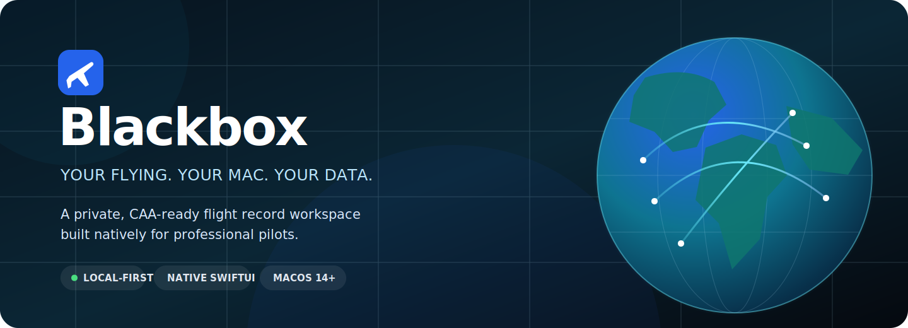
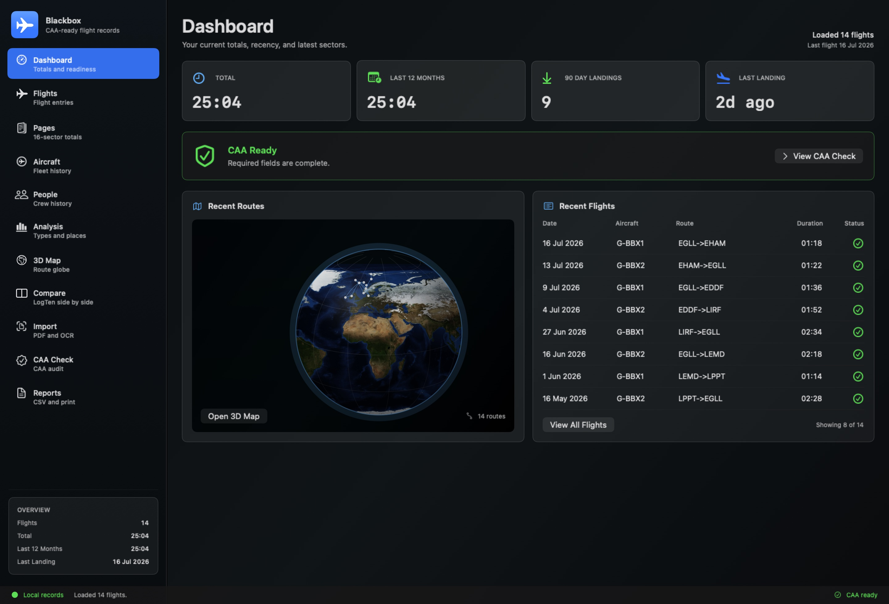
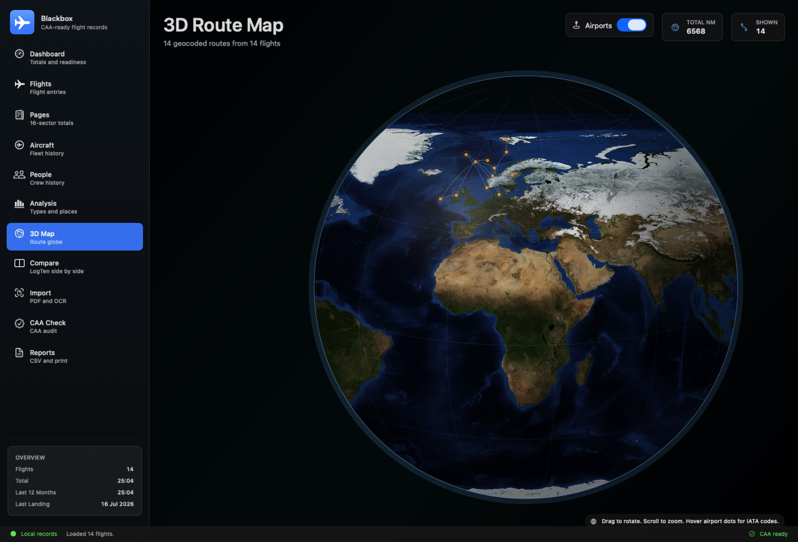
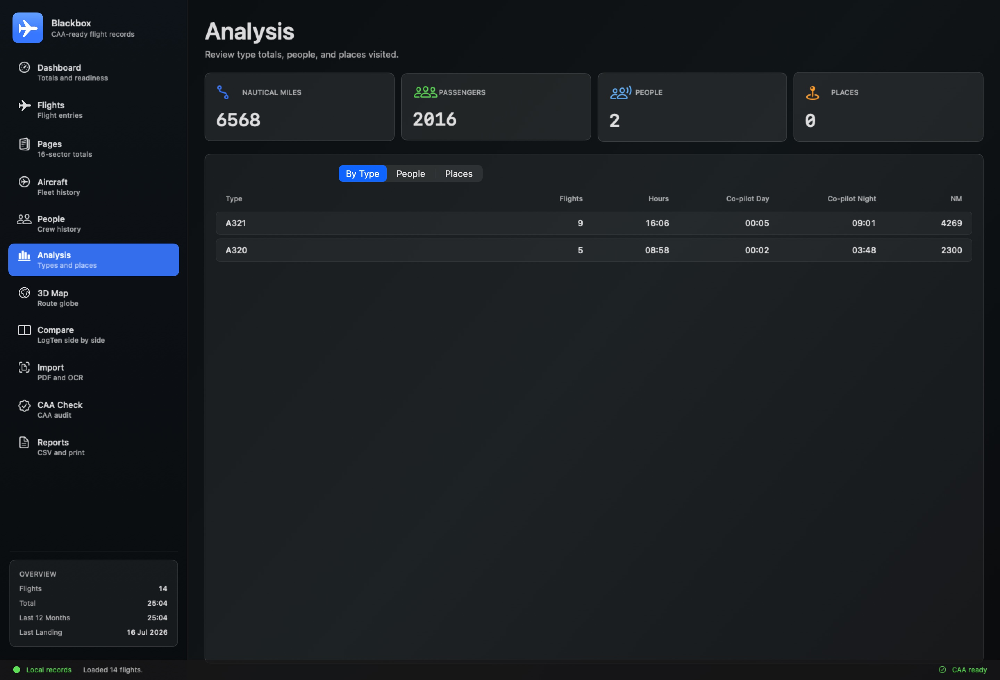

<p align="center">
  
</p>

<p align="center">
  <strong>A privacy-first native macOS flight logbook for professional pilots.</strong><br>
  Import from LogTen Pro, understand your flying, check CAA readiness, and keep every record under your control.
</p>

<p align="center">
  <a href="https://github.com/JWLBOYCE/blackbox/actions/workflows/ci.yml"></a>
  
  
  <a href="LICENSE"></a>
</p>

<p align="center">
  <a href="#why-blackbox">Why Blackbox</a> ·
  <a href="#inside-the-cockpit">Screenshots</a> ·
  <a href="#capabilities">Capabilities</a> ·
  <a href="#get-started">Get started</a> ·
  <a href="docs/LOGTEN_IMPORT.md">LogTen import guide</a>
</p>

## Why Blackbox

Pilot records are personal, operationally important, and difficult to move between tools. Blackbox is a focused macOS workspace that keeps the source of truth on your computer while making the logbook genuinely useful: fast review, clear totals, visual routes, recency monitoring, and export-readiness checks in one place.

| Private by design | Built for real logbooks | More than a spreadsheet |
|:---|:---|:---|
| Local-only SQLite storage, read-only LogTen import, and encrypted backups. | `HH:MM` time entry, nautical miles, crew roles, FSTD, PIC/PICUS/co-pilot and instructor time. | Route globe, type and people analysis, duplicate detection, recency, validation, and printable reports. |

## Inside the cockpit

<p align="center">
  
</p>

<table>
  <tr>
    <td width="50%"></td>
    <td width="50%"></td>
  </tr>
  <tr>
    <td align="center"><strong>See every sector</strong><br><sub>Explore geocoded routes on an interactive Blue Marble globe.</sub></td>
    <td align="center"><strong>Understand your experience</strong><br><sub>Break down hours, distance, people, places, and aircraft types.</sub></td>
  </tr>
</table>

> Screenshots contain generated demonstration records only. Blackbox never requires real pilot data in the repository.

## Capabilities

### Record and review

- Flight and simulator entries with PIC, PICUS, co-pilot, dual, instructor, FSTD, IFR/instrument, and cross-country time.
- Captain, First Officer, Instructor, and other crew roles.
- Searchable flight history, logbook pages, aircraft, people, and airport views.
- Duplicate-flight detection and manual airport-coordinate overrides.

### Import with confidence

- Read-only import from LogTen Pro's `LogTenCoreDataStore.sql`.
- Timestamped backup before every import.
- Side-by-side LogTen comparison and documented field mappings.
- Roster policy that ignores ground duties and normalises IATA tokens to ICAO where possible.

### Stay current and export-ready

- CAA/FCL.050-oriented completeness checks.
- Last-12-months totals, 90-day landing and night-landing recency, and instrument-time monitoring.
- Position-based day/night calculations using bundled airport coordinates.
- CSV and printable HTML reports for portable, auditable records.

### Own the data

- Local-only SQLite database; no account and no hosted backend.
- Encrypted backup and restore.
- Privacy guards in Git and CI block databases, logbooks, rosters, exports, and other sensitive files.

## Get started

### Requirements

- macOS 14 or later
- Swift 5.9 or later

### Build and run

```bash
git clone https://github.com/JWLBOYCE/blackbox.git
cd blackbox
./script/build_and_run.sh
```

The script builds a local `Blackbox.app` bundle and opens it. To import an existing logbook, follow the [LogTen Pro import guide](docs/LOGTEN_IMPORT.md).

### Verify a change

```bash
swift build
swift run OpenPilotLogbookCoreUnitTests
swift run OpenPilotLogbookCoreSmokeTests
./script/build_and_run.sh --check
```

The snapshot checker renders the main app surfaces with synthetic records. Pull requests run the same checks in CI, followed by the private-data guard.

## Privacy promise

Never commit a real logbook, roster, database, PDF, spreadsheet, export, backup, or screenshot containing personal flight information. The repository blocks common private formats including `*.sqlite`, `*.db`, `*.sql`, `*.blackboxbackup`, PDFs, spreadsheets, and generated app output.

If you discover a security or privacy issue, please follow [SECURITY.md](SECURITY.md) rather than opening a public issue.

## Contributing

Contributions are welcome. Aviation-record correctness and privacy come first, so please read [CONTRIBUTING.md](CONTRIBUTING.md), the [repository protection guide](docs/REPOSITORY_PROTECTION.md), and the [publishing checklist](docs/GITHUB_PUBLISHING.md) before submitting a pull request.

## Licence

Blackbox is source-available under the [PolyForm Noncommercial 1.0.0 licence](LICENSE). You may use, study, and improve it for non-commercial purposes. Commercial use requires a separate licence from the copyright holder.
