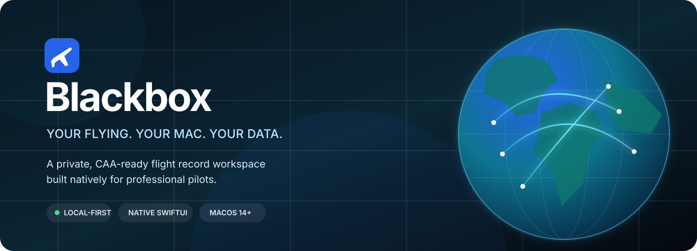
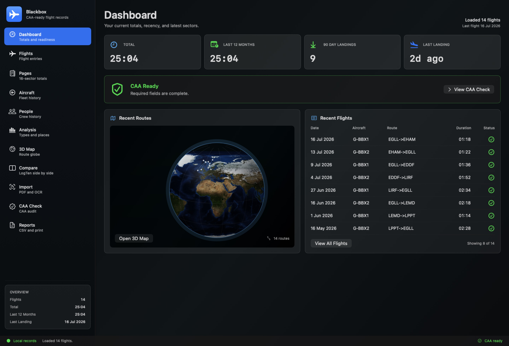
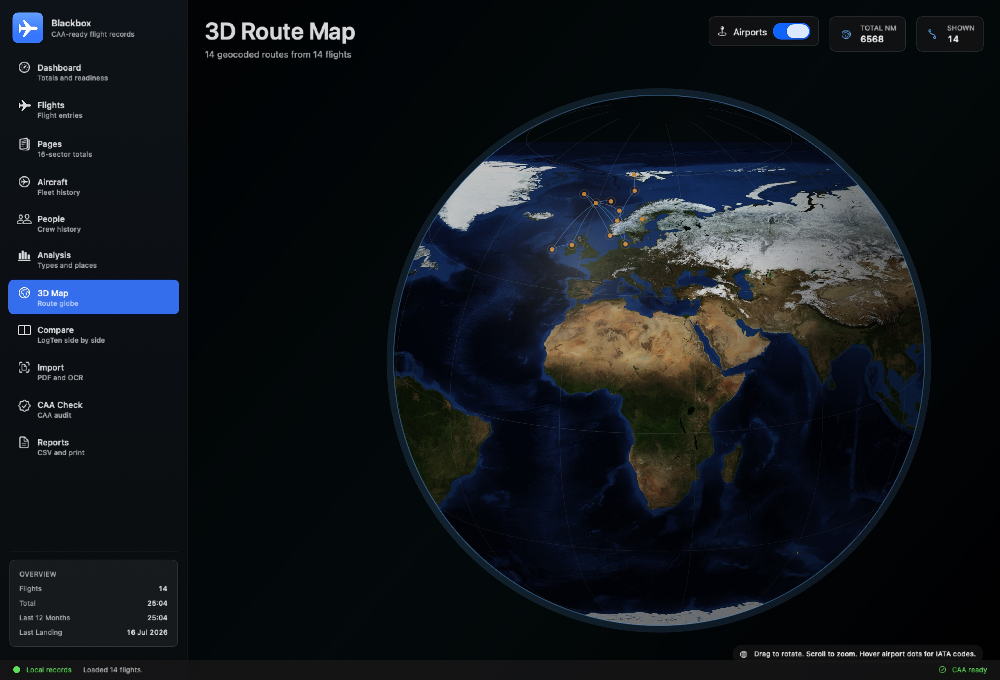
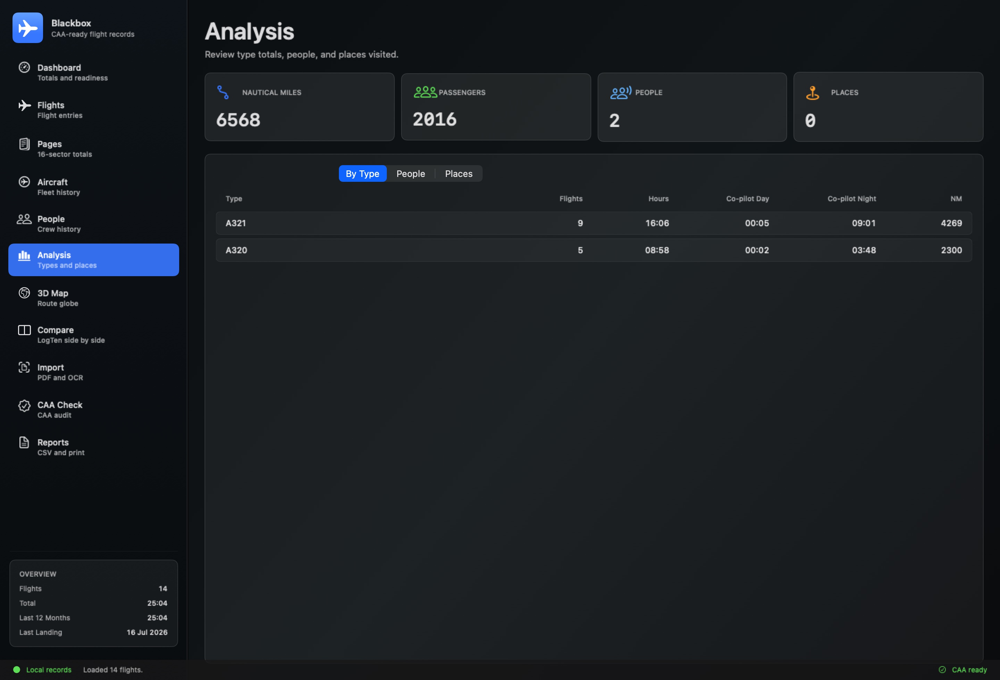

<p align="center">
  
</p>

<p align="center">
  <strong>A privacy-first native macOS flight logbook for professional pilots.</strong><br>
  Import from LogTen Pro, understand your flying, run internal logbook checks, and keep every record under your control.
</p>

<p align="center">
  <a href="https://github.com/JWLBOYCE/blackbox/actions/workflows/ci.yml"></a>
  
  
  <a href="LICENSE"></a>
</p>

<p align="center">
  <a href="#why-blackbox">Why Blackbox</a> ·
  <a href="#inside-the-cockpit">Screenshots</a> ·
  <a href="#capabilities">Capabilities</a> ·
  <a href="#get-started">Get started</a> ·
  <a href="docs/LOGTEN_IMPORT.md">LogTen import guide</a>
</p>

## Why Blackbox

Pilot records are personal, operationally important, and difficult to move between tools. Blackbox is a focused macOS workspace that keeps the source of truth on your computer while making the logbook genuinely useful: fast review, clear totals, visual routes, recency monitoring, and export-readiness checks in one place.

| Private by design | Built for real logbooks | More than a spreadsheet |
|:---|:---|:---|
| Local-only SQLite storage, read-only import previews, and encrypted backups. | `HH:MM` time entry, nautical miles, crew roles, FSTD, PIC/PICUS/co-pilot and instructor time. | Route globe, type and people analysis, duplicate detection, configurable recency, internal validation, and printable reports. |

## Inside the cockpit

<p align="center">
  
</p>

<table>
  <tr>
    <td width="50%"></td>
    <td width="50%"></td>
  </tr>
  <tr>
    <td align="center"><strong>See every sector</strong><br><sub>Explore geocoded routes on an interactive Blue Marble globe.</sub></td>
    <td align="center"><strong>Understand your experience</strong><br><sub>Break down hours, distance, people, places, and aircraft types.</sub></td>
  </tr>
</table>

> Screenshots contain generated demonstration records only. Blackbox never requires real pilot data in the repository.

## Capabilities

### Record and review

- Flight and simulator entries with PIC, PICUS, co-pilot, dual, instructor, FSTD, IFR/instrument, and cross-country time.
- Captain, First Officer, Instructor, and other crew roles.
- Searchable flight history, logbook pages, aircraft, people, and airport views.
- Explicit Save Draft and Finalise & Lock workflows, preserved amendments, durable revisions, and recoverable Trash.
- Suggestions are labelled and require acceptance; entered flight facts are never silently repaired or normalised.

### Import with confidence

- Read-only previews for LogTen Pro and document/OCR sources, with field-level selection and duplicate/conflict decisions.
- A verified recovery backup and staged database are created before an approved import changes the active database.
- Blackbox-only rows are preserved; a missing source row never deletes a flight.
- Side-by-side LogTen comparison has explicit unavailable, empty, failed, different, and genuine-match states.

### Stay current and export-ready

- Internal completeness and consistency checks. They are not regulatory certification.
- Last-12-months totals and configurable 90-day landing, night-landing, and instrument-time indicators.
- Conservative, provenance-labelled day/night suggestions that require explicit acceptance.
- CSV, printable HTML, and CAA-format reports for portable, auditable records.

### Own the data

- Local-only SQLite database; no account and no hosted backend.
- Encrypted backup inspection and staged restore with verification, recovery points, and operation history.
- Privacy guards in Git and CI block databases, logbooks, rosters, exports, and other sensitive files.

## Get started

### Requirements

- macOS 14 or later
- Swift 5.9 or later

### Build and run

```bash
git clone https://github.com/JWLBOYCE/blackbox.git
cd blackbox
./script/build_and_run.sh
```

The development script builds a local `Blackbox.app` and opens it against a fresh temporary synthetic data root. Debug, screenshot, and UI-test launches fail closed rather than opening the production logbook. To understand the production import workflow, read the [LogTen Pro import guide](docs/LOGTEN_IMPORT.md); do not use real pilot records for development or tests.

### Verify a change

```bash
swift build --scratch-path /tmp/blackbox-build
swift test --scratch-path /tmp/blackbox-tests
swift run OpenPilotLogbookCoreUnitTests
swift run OpenPilotLogbookCoreSmokeTests
./script/build_and_run.sh --check
```

The snapshot checker renders 72 synthetic screenshots across the principal screens, appearances, and widths. Pull requests pin full Xcode for hosted macOS UI workflows, run the privacy gates, and produce an unsigned Universal 2 archive only after verification. Signing and notarisation use local Keychain credentials that never enter CI.

## Privacy promise

Never commit a real logbook, roster, database, PDF, spreadsheet, export, backup, or screenshot containing personal flight information. The repository blocks common private formats including `*.sqlite`, `*.db`, `*.sql`, `*.blackboxbackup`, PDFs, spreadsheets, and generated app output.

If you discover a security or privacy issue, please follow [SECURITY.md](SECURITY.md) rather than opening a public issue.

## Contributing

Contributions are welcome. Aviation-record correctness and privacy come first, so please read [CONTRIBUTING.md](CONTRIBUTING.md), the [repository protection guide](docs/REPOSITORY_PROTECTION.md), and the [publishing checklist](docs/GITHUB_PUBLISHING.md) before submitting a pull request.

## Licence

Blackbox is source-available under the [PolyForm Noncommercial 1.0.0 licence](LICENSE). You may use, study, and improve it for non-commercial purposes. Commercial use requires a separate licence from the copyright holder.
